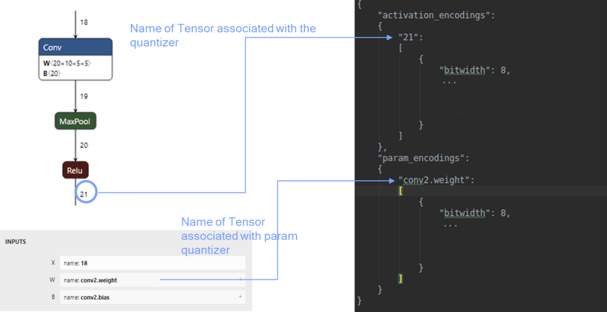

:orphan:

.. _api-quantization-encoding-spec:

AIMET Quantization Simulation determines scale/offset values for activation and parameter tensors in the model.
This scale/offset information is also referred to as 'quantization encoding'.
When a model is exported from the AIMET Quantization Simulation feature,
an encoding file is also exported that contains quantization encodings for the model.
This encoding file can then be used by an inference runtime when running the model on-target.

The following specification describes the format of this encoding file produced by AIMET.

Encoding Format Specification
=============================

The encodings from Quantization simulation can be exported for usage on run-time. The encoding file uses a JSON syntax.
The file format is usable with both PyTorch and TensorFlow models, that maps tensor names with the encodings.

1. Versioning
=============

Encoding format will follow ``XX.YY.ZZ`` versioning format as describe below,

* ``XX`` = Major Revision
* ``YY`` = Minor Revision
* ``ZZ`` = Patching version

Change in major revision should indicate substantial change to the format, updates to minor version indicates additional information element being added to encoding format and might require update to fully consume the encodings.  The patching version shall be updated to indicate minor updates to quantization simulation e.g. bug fix etc.

2. Version 0.4.0 (up to)
========================

The encoding format as defined below is backward compatible and shall applicable to all exported encoding up to version 0.4. In case, where versioning information is missing the encoding is assumed to follow version 0.4 format.

2.1. Encoding Specification
---------------------------

.. code-block::

   “version”: “string”
   “activation_encodings”:
   {
       <tensor_name>: [Encoding, …]
   }
   “param_encodings”
   {
       <tensor_name>: [Encoding, …]
   }

Where,

* ``"version”`` is set to “0.4.0”
* ``<tensor_name>`` is a string representing the tensor in onnx or tensorflow graph.

Encoding is as defined below,

.. code-block::

   Encoding:{
      bitwidth: integer
      is_symmetric: string
      max: float
      min: float
      offset: integer
      scale: float
   }

Where,

* ``bitwidth``\ : constraints >=4 and <=32
* ``is_symmetric``\ : allowed choices “True”, “False”

if a tensor is assigned **more than one** Encoding then the encoding is at per channel basis.\

2.2. Encoding File Example for PyTorch
--------------------------------------

On PyTorch, the tensor names shall be derived from the ONNX named model representation as depicted below on a sample model.

Given below is the sample format with keys and values for encodings JSON output file on PyTorch.

.. code-block::

   {
       “version”: “0.4.0”
       "activation_encodings": {
           "20":
           [
               {
                   "bitwidth": 8,
                   "is_symmetric": “False”,
                   "max": 2.6086959838867188,
                   "min": -2.109158515930176,
                   "offset": -114.0,
                   "scale": 0.018501389771699905
               }
           ],
           "21":
           [
               {
                   "bitwidth": 8,
                   "is_symmetric": “False”,
                   "max": 2.558866932988167,
                   "min": -0.12636379897594452,
                   "offset": -12.0,
                   "scale": 0.010530316270887852
               }
           ],
       },
       "param_encodings": {
           "conv2.weight":
           [
               {
                   "bitwidth": 8,
                   "is_symmetric": “False”,
                   "max": 0.06318144500255585,
                   "min": -0.06268782913684845,
                   "offset": -127.0,
                   "scale": 0.0004936049808748066
               }
           ],
           "fc1.weight":
            [
               {
                   "bitwidth": 8,
                   "is_symmetric": “False”,
                   "max": 0.05589814856648445,
                   "min": -0.05546144023537636,
                   "offset": -127.0,
                   "scale": 0.0004367042565718293
               }
           ],
       }
   }

2.3. Encoding File Example for TensorFlow
-----------------------------------------

Given below is a sample format with the keys and values for encodings on TensorFlow graph (in JSON format).

.. code-block::

   {
       “version”: “0.4.0”
       "activation_encodings": {
           "conv2d/Relu:0":
           [
               {
                   "bitwidth": 8,
                   "is_symmetric": “False”,
                   "max": 2.184721499681473,
                   "min": -0.10788747668266296,
                   "offset": 11,
                   "scale": 0.0089906234367221
               }
           ],
           "conv2d_1/Relu:0":
           [
               {
                   "bitwidth": 8,
                   "is_symmetric": “False”,
                   "max": 2.1020304188132286,
                   "min": -0.10380396991968155,
                   "offset": 11,
                   "scale": 0.008650330936207491
               }
           ],
       },
       "param_encodings": {
           "conv2d/Conv2D/ReadVariableOp:0":
           [
               {
                   "bitwidth": 8,
                   "is_symmetric": “False”,
                   "max": 0.1462666392326355,
                   "min": -0.1451239287853241,
                   "offset": 126,
                   "scale": 0.0011427081098743512
               }
           ],
           "conv2d_1/Conv2D/ReadVariableOp:0":
           [
               {
                   "bitwidth": 8,
                   "is_symmetric": “False”,
                   "max": 0.08333279937505722,
                   "min": -0.08268175274133682,
                   "offset": 126,
                   "scale": 0.0006510374592799766
               }
           ]
       }
   }

3. Version 0.5.0
================

3.1. Encoding Specification
---------------------------

.. code-block::

   “version”: “string”
   “activation_encodings”:
   {
       <tensor_name>: [Encoding, …]
   }
   “param_encodings”
   {
       <tensor_name>: [Encoding, …]
   }

Where,

* ``"version”`` is set to “0.5.0”
* ``<tensor_name>`` is a string representing the tensor in onnx or tensorflow graph.

``‘Encoding’`` structure shall include an encoding field ``“dtype”`` to specify the datatype used for simulating the tensor.

.. code-block::

   Encoding:{
       dtype: string
       bitwidth: integer
       is_symmetric: string
       max: float
       min: float
       offset: integer
       scale: float
   }

Where,

* ``dtype``\ : allowed choices “int”, “float”
* ``bitwidth``\ : constraints >=4 and <=32
* ``is_symmetric``\ : allowed choices “True”, “False”

when ``dtype`` is set to ``‘float’``\ , Encoding shall have the following fields

.. code-block::

   Encoding:{
       dtype: string
       bitwidth: integer
   }

``bitwidth`` defines the precision of the tensor being generated by the producer and consumed by the
downstream consumer(s).

3.2. Encoding File Example for PyTorch
--------------------------------------

Given below is a snippet of the sample format with change highlighted.

.. code-block::

   {
       “version”: “0.5.0”
       "activation_encodings": {
           "20":
           [
               {
                   “dtype”: “int”
                   "bitwidth": 8,
                    ...
               }
           ],
            ...
       },
       "param_encodings": {
           "conv2.weight":
           [
               {
                   “dtype”: “int”
                   "bitwidth": 8,
                   ...
               }
           ],
            ...
      }
   }

3.3. Encoding File Example for TensorFlow
-----------------------------------------

Given below is a snippet of the sample format with change highlighted.

.. code-block::

   {
       “version”: “0.5.0”
       "activation_encodings": {
           "conv2d/Relu:0":
           [
               {
                   “dtype”: “float”
                   "bitwidth": 16,
           ],
            ...
       },
       "param_encodings": {
           "conv2d/Conv2D/ReadVariableOp:0":
           [
               {
                   “dtype”: “float”
                   "bitwidth": 16,
               }
           ],
            ...
   }

4. Version 0.6.1
================
Adds a new field called ``quantizer_args`` to all exported encodings files.

4.1. Encoding Specification
---------------------------

.. code-block::

   “version”: “string”
   “activation_encodings”:
   {
       <tensor_name>: [Encoding, …]
   }
   “param_encodings”
   {
       <tensor_name>: [Encoding, …]
   }
   "quantizer_args":
   {
        "activation_bitwidth": integer,
        "dtype": string,
        "is_symmetric": string,
        "param_bitwidth": integer,
        "per_channel_quantization": string,
        "quant_scheme": "string"
   }

Where,

* ``"version”`` is set to “0.6.1”
* ``<tensor_name>`` is a string representing the tensor in onnx or tensorflow graph.

``‘Encoding’`` structure shall include an encoding field ``“dtype”`` to specify the datatype used for simulating the tensor.

.. code-block::

   Encoding:{
       dtype: string
       bitwidth: integer
       is_symmetric: string
       max: float
       min: float
       offset: integer
       scale: float
   }

Where,

* ``dtype``\ : allowed choices “int”, “float”
* ``bitwidth``\ : constraints >=4 and <=32
* ``is_symmetric``\ : allowed choices “True”, “False”

when ``dtype`` is set to ``‘float’``\ , Encoding shall have the following fields

.. code-block::

   Encoding:{
       dtype: string
       bitwidth: integer
   }

``bitwidth`` defines the precision of the tensor being generated by the producer and consumed by the
downstream consumer(s).

The ``quantizer_args`` structure describes the settings used to configure the quantization simulation model, and contains
usable information about how encodings were computed.
The field is auto-populated and should not require a manual edit from users. It can be broken down as follows:

* ``activation_bitwidth``\ : Indicates the bit-width set for all activation encodings.
* ``dtype``\ : Indicates if computation occurred in floating point or integer precision.
* ``is_symmetric``\ : If set to true, it indicates that parameter encodings were computed symmetrically.
* ``param_bitwidth``\ : Indicates the bit-width set for all parameter encodings.
* ``per_channel_quantization``\ : If set to True, then quantization encodings were computed for each channel axis of the tensor.
* ``quant_scheme``\ : Indicates the quantization algorithm used, which may be one of post_training_tf or post_training_tf_enhanced.

The intended usage of ``quantizer_args`` is to provide debugging information for customers who may need to perform
post-quantization tasks, which could benefit from knowledge of how the encoding information was obtained.