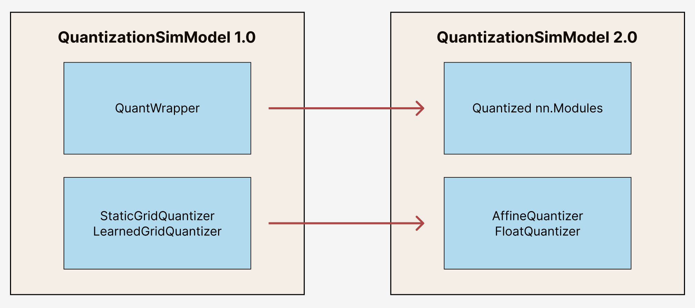

.. _tutorials-migration-guide:

.. role:: python(code)
   :language: python

Migrate to aimet_torch.v2
=========================

Learn how to migrate your code from aimet_torch v1 to aimet_torch v2!

Migration to aimet_torch v2 enables access to new features, easier debugging, and simpler code that is easier to extend. This guide provides an overview of the migration process and describes the fundamental differences between the two versions.

.. note::

    Please be advised that aimet_torch v2 is an experimental feature whose APIs and behaviors are subject to change.

Changes in aimet_torch v2
----------------------------

Before migrating, it is important to understand the behavior and API differences between aimet_torch v1 and aimet_torch v2. Users can interact with aimet_torch through the high level APIs in the same way. Methods like ``compute_encodings()`` and ``export()`` will remain the same.

Under the hood, aimet_torch v2 has a different set of building blocks and properties than aimet_torch v1, as shown below:

Migration Process
-----------------

The migration process includes the following:

1. Update imports of QuantizationSimModel and other features
2. Change how internal components of QuantizationSimModel are accessed
3. Remove any dependency on deprecated features

Imports
~~~~~~~~~~

To migrate to aimet_torch v2, your imports should originate from the :mod:`aimet_torch.v2` namespace and be replaced as shown below. If your code does not directly access lower-level components, no further code change is needed.

===================== ====================================================== ==================================================================
AIMET Classes         :mod:`aimet_torch`                                     :mod:`aimet_torch.v2`
===================== ====================================================== ==================================================================
QuantSim              :class:`aimet_torch.quantsim.QuantizationSimModel`     :class:`aimet_torch.v2.quantsim.QuantizationSimModel`
AdaRound              :class:`aimet_torch.adaround.adaround_weight.AdaRound` :class:`aimet_torch.v2.adaround.AdaRound`
Sequential MSE        :class:`aimet_torch.seq_mse.apply_seq_mse`             :class:`aimet_torch.v2.seq_mse.apply_seq_mse`
QuantAnalyzer         :class:`aimet_torch.quant_analyzer.QuantAnalyzer`      :class:`aimet_torch.v2.quant_analyzer.QuantAnalyzer`
===================== ====================================================== ==================================================================

All the other import statements will stay the same, including but not limited to:

* :python:`from aimet_common.defs import QuantScheme`
* :python:`from aimet_torch.cross_layer_equalization import equalize_model`
* :python:`from aimet_torch.model_preparer import prepare_model`

=======

QuantizationSimModel
~~~~~~~~~~~~~~~~~~~~~

---------------------------------------------------
Moving from QuantWrapper to Quantized Modules
---------------------------------------------------

To enable quantization in aimet_torch v1, modules are wrapped with a QuantizeWrapper. These wrapped modules can be accessed as follows:

.. code-block:: Python

    from aimet_torch.quantsim import QuantizationSimModel as QuantizationSimModelV1
    sim = QuantizationSimModelV1(...)
    all_quant_wrappers = sim.quant_wrappers()
    for quant_wrapper in sim.quant_wrappers():
        print(quant_wrapper)

.. rst-class:: script-output

  .. code-block:: none

    StaticGridQuantWrapper(
        (_module_to_wrap): Linear(in_features=100, out_features=200, bias=True)
    )
    StaticGridQuantWrapper(
        (_module_to_wrap): ReLU()
    )

In contrast, aimet_torch v2 enables quantization through quantized nn.Modules - modules are no longer wrapped but replaced with a quantized version. For example, a nn.Linear would be replaced with QuantizedLinear, nn.Conv2d would be replace by QuantizedConv2d, and so on. The quantized module definitions can be found under :mod:`aimet_torch.v2.nn`. These quantized modules can be accessed as follows:

.. code-block:: Python

    from aimet_torch.v2.quantsim.quantsim import QuantizationSimModel as QuantizationSimModelV2
    sim2 = QuantizationSimModelV2(...)
    all_q_modules = sim2.qmodules()
    for q_module in sim2.qmodules():
        print(q_module)

.. rst-class:: script-output

  .. code-block:: none

    QuantizedLinear(
            in_features=100, out_features=200, bias=True
            (param_quantizers): ModuleDict(
                (weight): QuantizeDequantize(shape=[1], bitwidth=8, symmetric=True)
                (bias): None
            )
            (input_quantizers): ModuleList(
                (0): QuantizeDequantize(shape=[1], bitwidth=8, symmetric=False)
            )
            (output_quantizers): ModuleList(
                (0): None
            )
    )
    QuantizedReLU(
        (param_quantizers): ModuleDict()
        (input_quantizers): ModuleList(
            (0): None
        )
        (output_quantizers): ModuleList(
            (0): QuantizeDequantize(shape=[1], bitwidth=8, symmetric=False)
        )
    )

For more information on Quantized modules, please refer to the API reference guide :ref:`here<api-torch-quantized-modules>`.

-------------------------------------------------------------------------------
Moving from StaticGrid and LearnedGrid Quantizer to Affine and Float Quantizer
-------------------------------------------------------------------------------

In aimet_torch v1, we relied on StaticGridQuantizer and LearnedGridQuantizer. For both, floating point quantization could be enabled based on ``QuantizationDataType`` passed in.

.. code-block:: Python

    from aimet_torch.v1.tensor_quantizer import StaticGridPerChannelQuantizers
    from aimet_common.defs import QuantizationDataType

    fp_quantizer = StaticGridPerChannelQuantizer(data_type = QuantizationDataType.float, ...)
    affine_quantizer = StaticGridPerChannelQuantizer(data_type = QuantizationDataType.int, ...)

However, in aimet_torch v2, this functionality is separated into an AffineQuantizer and a FloatQuantizer. Users can access these quantizers and related operations under `aimet_torch.v2.quantization`.

.. code-block:: Python

    import aimet_torch.v2.quantization as Q

    affine_q = Q.affine.Quantize(shape=(5, 1), bitwidth=8, symmetric=False)
    affine_qdq = Q.affine.QuantizeDequantize(shape=(5, 1), bitwidth=8, symmetric=False)
    fp_qdq = Q.float.FloatQuantizeDequantize(dtype=torch.float16)

From the wrapped module (aimet_torch v1) or quantized module (aimet_torch v2), the attributes to access the quantizers remain consistent: ``.input_quantizers`` for input quantizers, ``.output_quantizers`` for output quantizers, and ``.param_quantizers`` for parameter quantizers.

For more information on Quantizers, please refer to the API reference guide :ref:`here<api-torch-quantizers>`.

-----------------------------
Code Examples
-----------------------------
**Setup**

.. code-block:: Python

    # aimet_torch v1
    from aimet_torch.quantsim import QuantizationSimModel as QuantizationSimModelV1

    sim1 = QuantizationSimModelV1(...)
    wrap_linear = sim1.model.linear

    # aimet_torch v2
    from aimet_torch.v2.quantsim.quantsim import QuantizationSimModel as QuantizationSimModelV2

    sim2 = QuantizationSimModelV2(...)
    qlinear = sim2.model.linear

**Case 1: Manually setting common attributes**

*Bitwidth*

.. code-block:: Python

    # aimet_torch v1
    wrap_linear.param_quantizers['weight'].bitwidth = 4
    wrap_linear.input_quantizers[0].bitwidth = 4
    wrap_linear.output_quantizers[0].bitwidth = 4

    # aimet_torch v2
    if qlinear.param_quantizers['weight']:
        module.param_quantizers['weight'].bitwidth = 4

    if qlinear.input_quantizers[0]:
        qlinear.input_quantizers[0].bitwidth = 4

    if qlinear.output_quantizers[0]:
        qlinear.output_quantizers[0].bitwidth = 4

*Symmetry*

.. code-block:: Python

    # aimet_torch v1
    wrap_linear.param_quantizers['weight'].use_symmetric_encodings = True
    wrap_linear.param_quantizers['weight'].is_unsigned_symmetric = False
    wrap_linear.param_quantizers['weight'].use_strict_symmetric = False

    wrap_linear.input_quantizers[0].use_symmetric_encodings = True
    wrap_linear.input_quantizers[0].is_unsigned_symmetric = False
    wrap_linear.input_quantizers[0].use_strict_symmetric = False

    wrap_linear.output_quantizers[0].use_symmetric_encodings = True
    wrap_linear.output_quantizers[0].is_unsigned_symmetric = False
    wrap_linear.output_quantizers[0].use_strict_symmetric = False

    # aimet_torch v2
    # Notes: simplified into two flags
    if qlinear.param_quantizers['weight']:
        qlinear.param_quantizers['weight'].symmetric = True
        qlinear.param_quantizers['weight'].signed = True

    if qlinear.input_quantizers[0]:
        qlinear.input_quantizers[0].symmetric = True
        qlinear.input_quantizers[0].signed = True

    if qlinear.output_quantizers[0]:
        qlinear.output_quantizers[0].symmetric = True
        qlinear.output_quantizers[0].signed = True

*Encoding Data*

.. code-block:: Python

    # aimet_torch v1
    import libpymo

    if wrap_linear.param_quantizers['weight'].encoding:
        encoding = libpymo.TfEncoding()
        encoding.max = 1
        encoding.min = -1
        wrap_linear.param_quantizers['weight'].encoding = encoding

    if wrap_linear.input_quantizers[0].encoding:
        encoding = libpymo.TfEncoding()
        encoding.max = 1
        encoding.min = -1
        wrap_linear.input_quantizers[0].encoding = encoding

    if wrap_linear.output_quantizers[0].encoding:
        encoding = libpymo.TfEncoding()
        encoding.max = 1
        encoding.min = -1
        wrap_linear.output_quantizers[0].encoding = encoding

    # aimet_torch v2
    # Notes: TfEncoding() is no longer used, encoding min/max are of type torch.nn.Parameter
    if qlinear.param_quantizers['weight']:
        qlinear.param_quantizers['weight'].min.copy_(-1.0)
        module.param_quantizers['weight'].max.copy_(1.0)

    if qlinear.input_quantizers[0]:
        qlinear.input_quantizers[0].min.copy_(-1.0)
        qlinear.input_quantizers[0].max.copy_(1.0)

    if qlinear.output_quantizers[0]:
        qlinear.output_quantizers[0].min.copy_(-1.0)
        qlinear.output_quantizers[0].max.copy_(1.0)

**Case 2: Enabling and Disabling Quantization**

*Is quantization enabled?*

.. code-block:: Python

    # aimet_torch v1
    if wrap_linear.param_quantizers['weight'].enabled:
        pass

    # aimet_torch v2
    # Notes: Quantizers no longer have an 'enabled' attribute. If a quantizer is present, it is enabled
    if qlinear.param_quantizers['weight']:
        pass

*Disabling Quantization*

.. code-block:: Python

    # aimet_torch v1
    wrap_linear.param_quantizers['weight'].enabled = False

    # aimet_torch v2
    # Notes: Quantizers can be disabled by setting them to None OR using the utility API (_remove_input_quantizers, _remove_output_quantizers, _remove_param_quantizers)
    qlinear.param_encodings["weight"] = None

    qlinear._remove_param_quantizers('weight')

*Enabling Quantization*

.. code-block:: Python

    # aimet_torch v1
    wrap_linear.param_quantizers['weight'].enabled = True

    # aimet_torch v2
    import aimet_torch.v2.quantization as Q
    qlinear.param_quantizers['weight'] = Q.affine.QuantizeDequantize(...)

*Temporarily disabling Quantization*

.. code-block:: Python

    # aimet_torch v1
    assert wrap_linear.param_quantizers['weight'].enabled
    wrap_linear.param_quantizers['weight'].enabled = False
    # Run other code here
    wrap_linear.param_quantizers['weight'].enabled = True

    # aimet_torch v2
    assert qlinear.param_quantizers['weight']
    with qlinear._remove_param_quantizers('weight'):
        assert qlinear.param_quantizers['weight'] is None
        # Run other code here

    assert qlinear.param_quantizers['weight']

**Case 3: Freezing encodings**

.. code-block:: Python

    # aimet_torch v1
    if not wrap_linear.param_quantizers['weight']._is_encoding_frozen:
        wrap_linear.param_quantizers['weight'].freeze_encodings()

    # aimet_torch v2
    # Notes: There is no longer a concept of "freezing". Mimicking v1 freezing behavior involves the allow_overwrite and requires_grad_ flag
    qlinear.param_quantizers['weight'].allow_overwrite(False)  # Prevents encodings from being overwritten by AIMET APIs
    qlinear.param_quantizers['weight'].requires_grad_(False)   # Prevents encodings from being learned
