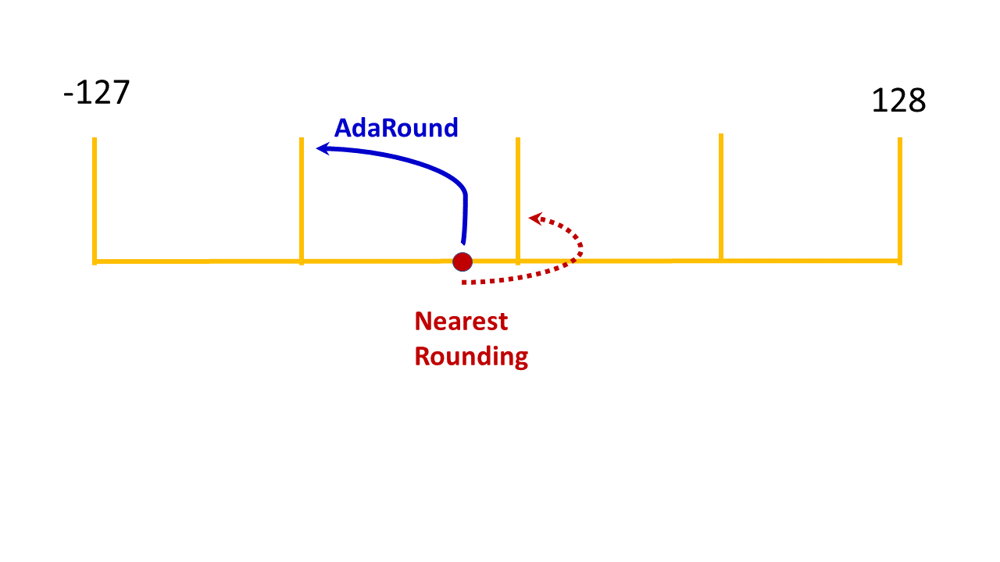

:orphan:

.. _ug-adaround:

=====================
AIMET AdaRound
=====================

 AIMET quantization features, by default, use the "nearest rounding" technique for achieving quantization.
 In the following figure, a single weight value in a weight tensor is shown as an illustrative example. When using the
 "nearest rounding" technique, this weight value is quantized to the nearest integer value. The Adaptive Rounding
 (AdaRound) feature, uses a smaller subset of the unlabelled training data to adaptively round the weights of modules
 with weights. In the following figure, the weight value is quantized to the integer value far from it. AdaRound,
 optimizes a loss function using the unlabelled training data to adaptively decide whether to quantize a specific
 weight to the integer value near it or away from it. Using the AdaRound quantization, a model is able to achieve an
 accuracy closer to the FP32 model, while using low bit-width integer quantization.

 When creating a QuantizationSimModel using the AdaRounded model, use the QuantizationSimModel provided API for
 setting and freezing parameter encodings before computing the encodings. Please refer the code example in the AdaRound
 API section.

=====================
AdaRound Use Cases
=====================
=====================
Common terminology
=====================
	* BC - Bias Correction
	* BNF - Batch Norm Folding
	* CLE - Cross Layer Equalization
	* HBF -  High Bias Folding
	* QAT - Quantization Aware Training
	* { } - An optional step in the use case

=====================
Use Cases
=====================

 #. {BNF} --> {CLE} --> AdaRound
       Applying BNF and CLE are optional steps before applying AdaRound. Some models benefit from applying CLE
       while some don't get any benefit.

 #. AdaRound --> QAT
       AdaRound is a post-training quantization feature. But, for some models applying BNF and CLE may not be beneficial.
       For these models, QAT after AdaRound may be beneficial. AdaRound is considered as a better weights initialization
       step which helps for faster QAT.

=====================
 Not recommended
=====================
Applying BC either before or after AdaRound is not recommended.

 #. AdaRound --> BC

 #. BC --> AdaRound

=====================================
 AdaRound Hyper parameters guidelines
=====================================

There are couple of hyper parameters required during AdaRound optimization and are exposed to users. But some of them
are with their default values which lead to good and stable results over many models and not recommended to change often.

Following is guideline for Hyper parameters:

#. Hyper Parameters to be changed often: number of batches (approximately 500-1000 images, if batch size of data loader
   is 64, then 16 number of batches leads to 1024 images), number of iterations(default 10000)

#. Hyper Parameters to be changed moderately: regularization parameter (default 0.01)

#. Hyper Parameters to be changed least: beta range(default (20, 2)), warm start period (default 20%)

|
