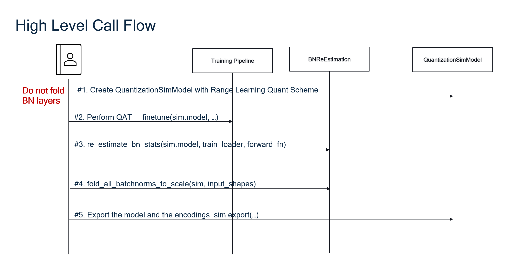

.. _ug-bn-reestimation:

##############################
AIMET Batch Norm Re-estimation
##############################

Overview
========

The Batch Norm (BN) re-estimation feature utilizes a small subset of training data to individually re-estimate the statistics of the BN layers in a model. These BN statistics are then used to adjust the quantization scale parameters of the preceeding Convolution or Linear layers. Effectively, the BN layers are folded.

The BN re-estimation feature is applied after performing Quantization Aware Training (QAT) with Range Learning, with Per Channel Quantization (PCQ) enabled. It is important *not* to fold the BN layers before performing QAT. Fold the BN layers only after QAT and the re-estimation of the BN statistics are completed. See the Workflow section below for the exact sequence of steps.

The BN re-estimation feature is specifically recommended for the following scenarios:

- Low-bitwidth weight quantization (e.g., 4-bits)
- Models for which Batch Norm Folding leads to decreased performance
- Models where the main issue is weight quantization (including higher bitwidth quantization)
- Low bitwidth quantization of depthwise separable layers since their Batch Norm Statistics are affected by oscillations

Workflow
========

BN re-estimation requires that:

1. BN layers not be folded before QAT.
2. Per Channel Quantization is enabled.

To use the BN re-estimation feature, the following sequence of steps must be followed in order:

1. Create the QuantizationSimModel object with Range Learning Quant Scheme
2. Perform QAT with Range Learning
3. Re-estimate the BN statistics
4. Fold the BN layers
5. Using the QuantizationSimModel, export the model and encodings.

Once the steps are completed, the model can be run on the target for inference.

The following sequence diagram shows the workflow for PyTorch.
The workflow is the same for TensorFlow and Keras.

BN Re-estimation API
====================

See the links below to view the BN re-estimation API for each AIMET variant:

- :ref:`BN Re-estimation for PyTorch<api-torch-bn-reestimation>`
- :ref:`BN Re-estimation for Keras<api-keras-bn-reestimation>`

