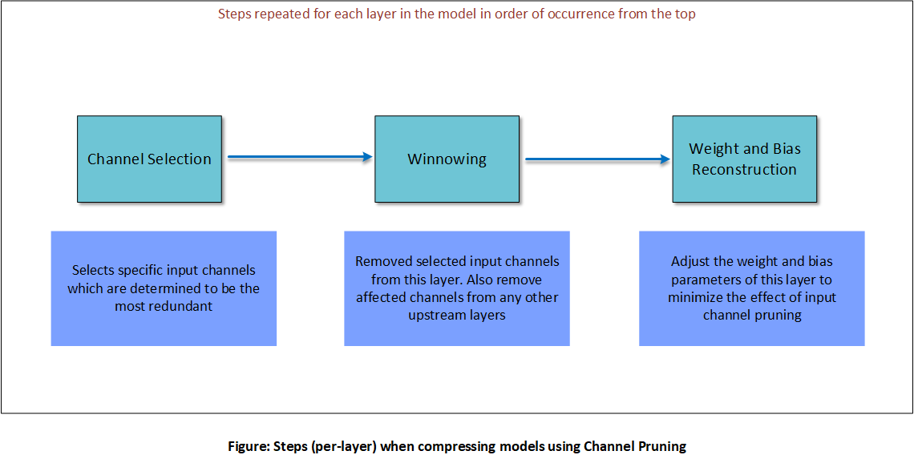
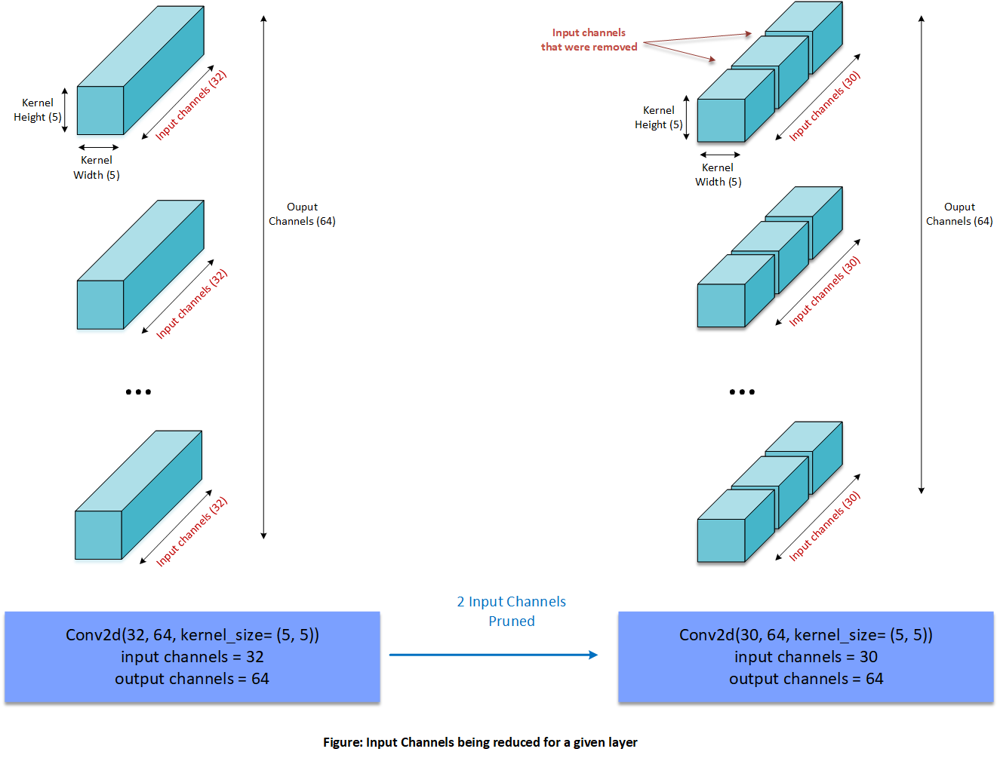
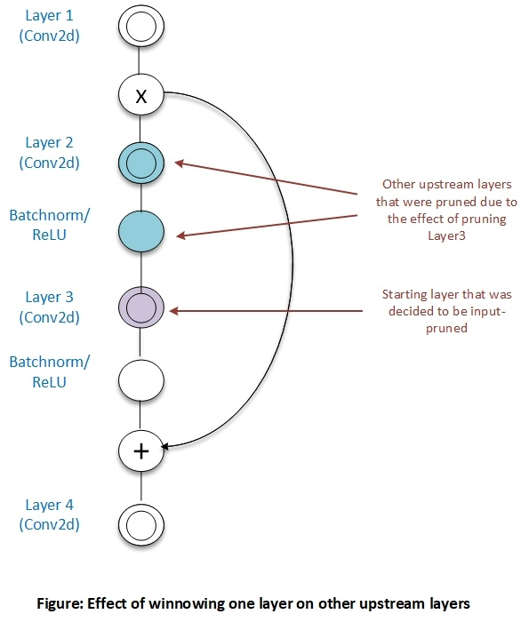
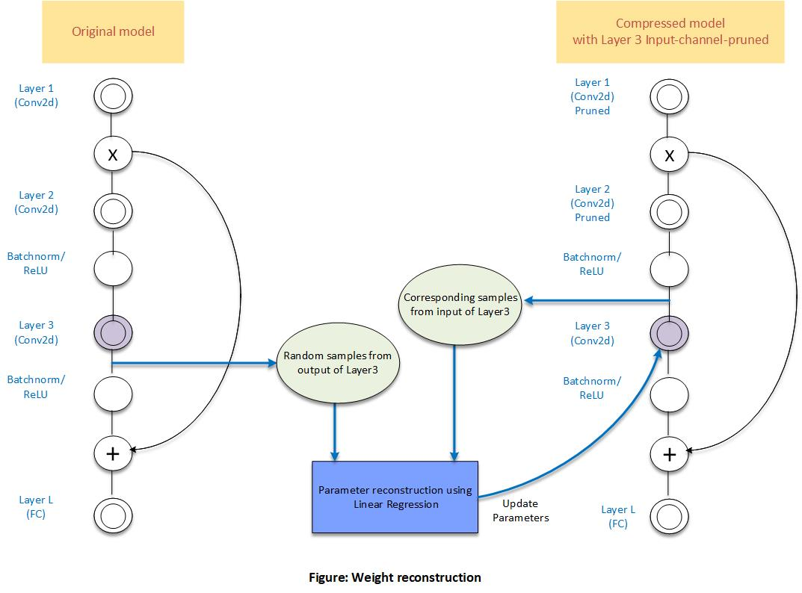

=====================
AIMET Channel Pruning
=====================

Channel Pruning is a model compression technique that reduces less-important input channels from layers in a given model. Currently AIMET supports Channel Pruning of Conv2d layers.

Overall Procedure
=================
The following picture explains the different steps in Channel Pruning a given layer. These steps are repeated for all layers selected to be compressed in the order of their occurrence from the top of the model.

These individual steps are explained in more detail in the following sub-sections.

Channel Selection
=================
For a given layer and a given compression ratio Channel Selection analyzes the magnitude of each input channel (based on the kernel weights for that channel) and chooses the channels with the least magnitude to be pruned.

Winnowing
=========
Winnowing is used to remove input channels of weight matrix obtained from Channel Selection resulting in compressed tensors

Once one or more input channels for a layer are removed, then it means corresponding output channels of a upstream layer could also be removed to get further compression gains. Note that the presence of skip-connections or residuals sometimes prevents upstream layers from getting output-pruned.

For more details on winnowing, please see this

.. toctree::
    :titlesonly:
    :maxdepth: 1

    Winnowing<winnowing>

Weight Reconstruction
=====================
As a final step in Channel Pruning, AIMET will adjust the weight and bias parameters of a layer that was pruned in an attempt to try and match the outputs of that layer to closely match the outputs prior to pruning.This is done by collecting random samples of the output of the layer from the original model and the corresponding input samples from the pruned model for that layer. AIMET then performs linear regression to adjust the layer parameters.

