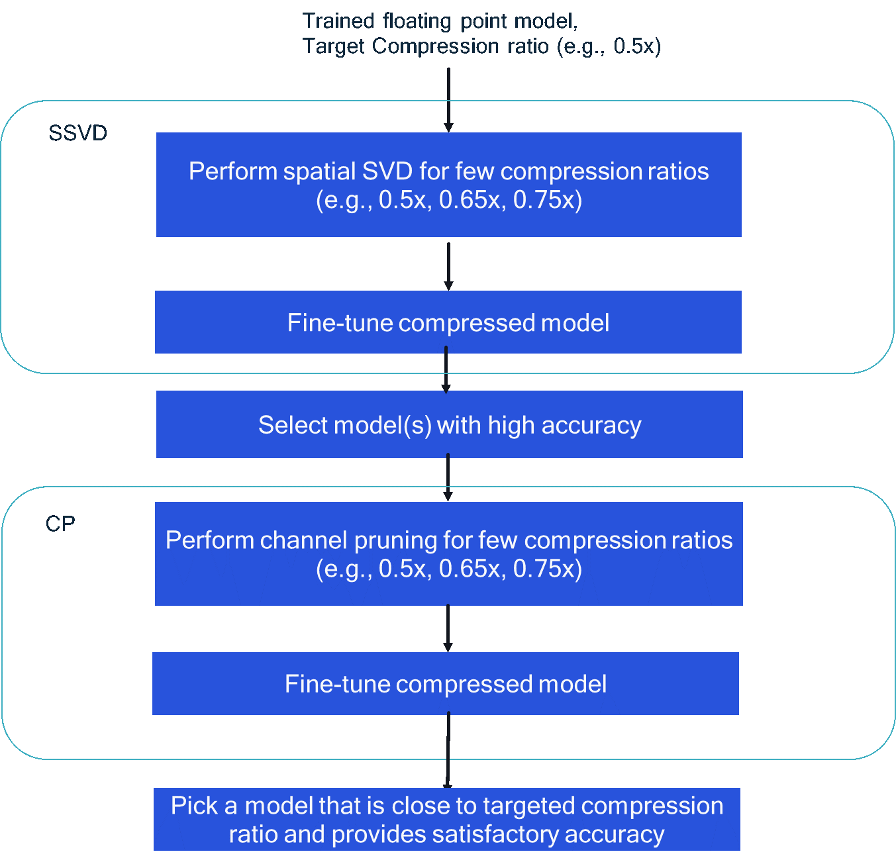

.. _ug-comp-guidebook:

====================================
AIMET Compression Features Guidebook
====================================

This document provides typical workflows in order to compress a network using AIMET. A more in-depth discussion on various techniques and their usage is provided in :ref:`User Guide<ug-index>`

AIMET supports network compression using the following techniques: Weight SVD, Spatial SVD (SSVD) and Channel Pruning (CP). These techniques are intended for Multiply-and-Accumulate (MAC) reduction of convolution layers in a neural network. Based on a configured desired MAC reduction ratio, i.e., MACs in compress model to MACs in uncompressed model, the compression algorithms automatically compress each individual convolution layer in the network to approximately reach the overall desired MAC reduction. Note that the actual on-target inference latency performance of a model depends on several factors MACs, memory and memory bandwidth, quantization, etc. Therefore, the improvement in runtime latency based on MAC reduction based compression may vary depending on the specific model architecture. Performance results for some typical models are provided in https://quic.github.io/aimet-pages/index.html.
For best performance, a combination of spatial SVD followed by channel pruning is recommended.  At high level, following steps should be performed to compress a network using SSVD + CP combination:

1.	Determine the target compression ratio (C), which is the ratio of MACs in final compressed model to the MACs in the original uncompressed model. For example, target compression ratio = 0.5 indicates that the final model MACs are half of the original model MACs.

2.	Perform compression using Spatial SVD technique as follows:

    a.	Since the target compression ratio C is for the final SSVD+CP compressed model, the compression that should be targeted or can be achieved via SSVD is unknown apriori. As a result, few target compression ratios   (Cssvd)need to be tried out. Choose few Cssvd > C targets and perform SSVD. E.g., if C = 0.5, Cssvd = {0.5,0.65, 0.75} can be used typically. This would result in three SSVD compressed models.

    b.	For each of the SSVD compressed model obtained from previous step, perform fine-tuning to improve model accuracy. Guidelines on fine-tuning are provided here [].

3.	Pick a model (or few models) that provide high accuracy from step 2b. For example, if the tolerable accuracy drop SSVD+CP compression relative to the original uncompressed model is X %  (X = Accuracy of uncompressed model (%)  Accuracy of compressed model (%)) , then a model(s) that has accuracy within few % (X-5 %)of the original uncompressed model accuracy should be selected to avoid very large drop in accuracy after CP step.

    a.	Note that if step 2b results in very large accuracy drop or  drop well within tolerable accuracy drop, then step 2a/2b should be revisited first by appropriately adjusting the compression ratios.

4.	Perform compression using Channel Pruning   technique as follows:

    a.	Perform compression with few target compression ratios (Ccp). One can set the compression ratio(s) based on the Cssvd of the model obtained from SSVD step 3 such that Cssvd * Ccp is approximately equal to C.

    b.	Perform fine-tuning to improve model accuracy.

5.  In the final step, a model is selected with MAC ratio relative to the original uncompressed model is close to C and also meets user's accuracy requirements. For example, for ResNet-50 results provided on https://quic.github.io/aimet-pages/index.html, Csvd = 0.75 and Ccp = 0.66 were used to achieve overall compression C = 0.5
