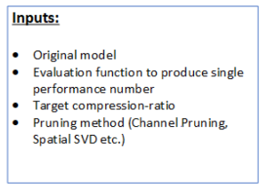
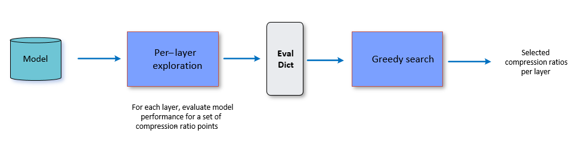
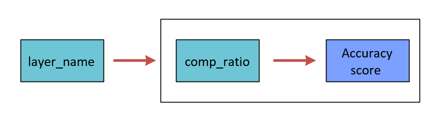
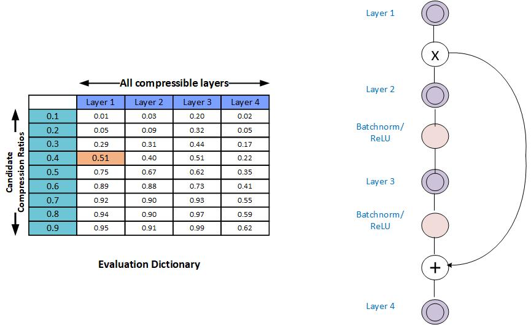
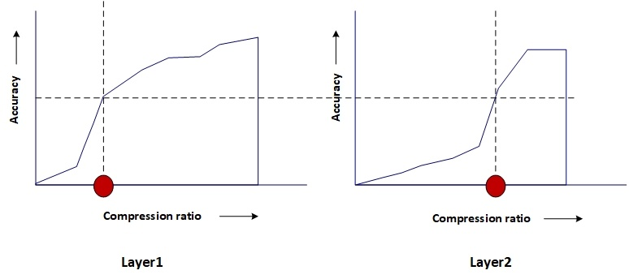

:orphan:

.. _ug-greedy-comp-ratio-selection:

========================================
AIMET Greedy Compression Ratio Selection
========================================

Overview
========
The model compression methods, Spatial SVD and Channel Pruning work on per layer basis. Not all the layers in the given model are equally compressible. Compression of individual layers of a given model can have varying impact on the final accuracy of the model. Greedy Per Layer Compression Ratio Selection Algorithm is used to assess the sensitivity of applicable layers to compression and find appropriate compression-ratio for each individual layers. The algorithm makes sure that the entire model has highest remaining accuracy and also meets the given target compression-ratio.

How it works
============
The Greedy Compression Ratio Selection algorithm executes the following two steps:

- Per-layer exploration
- Compression-ratio selection

The following figure provides a high level overview and is followed by details for each step.

|

|

where, the Eval dictionary is represented as-

Per-layer Exploration
=====================
For each layer, produces a column in the compression-ratio vs. model-performance table. This column captures the over all network performance values as the layer is compressed by predefined range of compression ratio candidates, while all other layers are left unmodified.

In the above figure, you see an example model with 4 layers, and 10 compression-ratio candidates (which is the default setting). Note that the table does not capture the eval score for the last candidate which is always compression-ratio=1.0 (since this score is the baseline score and known already).

**Monotonic Fit**: In some cases it is observed that the model performance is not a strict increasing function of increasing compression-ratios. To help with the greedy selection procedure, AIMET can apply a curve-fit scheme to try and fit the model-performance numbers for a given layer using a monotonically increasing function. The functionality is disabled by default.

Compression Ratio Selection
===========================
This step is the core of the algorithm. It considers the  compression-ratio vs. model-performance table for each applicable layer from the previous step, target compression ratio and function to calculate the cost of the compressed model depending on the compression method (Spatial SVD, Channel Pruning) used. It starts with a constant accuracy and finds the corresponding compression ratio for every applicable layer by interpolating from compression-ratio vs. model-performance evaluation table. The algorithm, then calculates total cost of the model to see if we have met our target compression ratio or not. Binary search algorithm is used to find the solution quickly.  Finally it returns list of selected compression ratios for all applicable layers. This way,  the algorithm achieves the highest remaining final accuracy of the compressed model and meet target compression ratio.

The following figure illustrates that for a given accuracy, the compression ratio for each layer is different.

As suggested by above diagram, the algorithm picks a lower compression ratio (higher compression) for layers which are more compressible and pick a higher compression ratio (lower compression) for layers which are less compressible (For lesser compressible layers the accuracy falls drstically if compression ratio is lowered).

