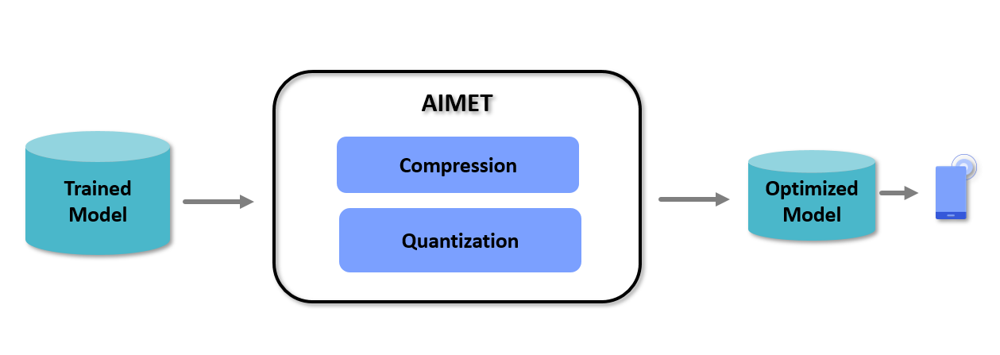

.. _ug-index:

======================================
AI Model Efficiency Toolkit User Guide
======================================

Overview
========

AI Model Efficiency Toolkit (AIMET) is a software toolkit that enables users to quantize and compress models.
Quantization is a must for efficient edge inference using fixed-point AI accelerators.

AIMET optimizes pre-trained models (e.g., FP32 trained models) using post-training and fine-tuning techniques that
minimize accuracy loss incurred during quantization or compression.

AIMET currently supports PyTorch, TensorFlow, and Keras models.

The above picture shows a high-level view of the workflow when using AIMET. The user will start with a trained
model in either the PyTorch, TensorFlow, or Keras training framework. This trained model is passed to AIMET using APIs
for compression and quantization. AIMET returns a compressed/quantized version of the model
that the users can fine-tune (or train further for a small number of epochs) to recover lost accuracy. Users can then
export via ONNX/meta/h5 to an on-target runtime like Qualcomm\ |reg| Neural Processing SDK.

Features
========

AIMET supports two sets of model optimization techniques:

- Model Quantization: AIMET can simulate behavior of quantized HW for a given trained
  model. This model can be optimized using Post-Training Quantization (PTQ) and fine-tuning (Quantization Aware Training
  - QAT) techniques.

- Model Compression: AIMET supports multiple model compression techniques that allow the
  user to take a trained model and remove redundancies, resulting in a smaller model that runs faster on target.

Release Information
===================

For information specific to this release, please see :ref:`Release Notes <ug-release-notes>` and :ref:`Known Issues <ug-known-issues>`.

Installation Guide
==================

Please visit the :ref:`AIMET Installation <ug-installation>` for more details.

Getting Started
===============

Please refer to the following documentation:

.. toctree::
   :maxdepth: 2

   Quantization User Guide <model_quantization>
   Compression User Guide <model_compression>
   API Documentation<../api_docs/index>
   Examples Documentation <examples>

|

|

| |project| is a product of |author|
| Qualcomm\ |reg| Neural Processing SDK is a product of Qualcomm Technologies, Inc. and/or its subsidiaries.

.. |reg|    unicode:: U+000AE .. REGISTERED SIGN
