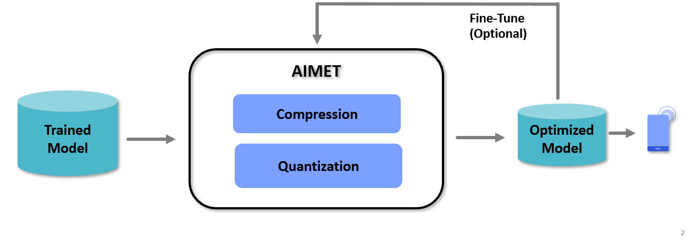

.. _ug-index:

======================================
AI Model Efficiency Toolkit User Guide
======================================

Overview
========

AI Model Efficiency Toolkit (AIMET) is a software toolkit that enables users to compress and quantize models.

AIMET provides optimizations that are designed to be used on trained models, so that the resulting compressed
and/or quantized model can be further trained (also called fine-tuning) to recover any accuracy losses.
AIMET currently supports both TensorFlow and PyTorch models.

|

The above picture shows a high-level view of the workflow when using AIMET. The user will start with a trained
model in either the TensorFlow or PyTorch training framework. This trained model is passed to AIMET using APIs
for compression and quantization that we will look at in detail. AIMET returns a compressed/quantized version of the model
that the users can fine-tune (or train further for a small number of epochs) to recover lost accuracy. Users can then
export via ONNX to an on-target runtime like Qualcomm\ |reg| Neural Processing SDK.

Features
========

AIMET supports two types of features

- :ref:`Model Compression<ug-model-compression>`: AIMET supports multiple model compression techniques that allow the user to take a trained model
  and remove redundancies, resulting in a smaller model that runs faster on target.

- :ref:`Model Quantization<ug-model-quantization>`: AIMET can simulate behavior of quantized HW for a given trained model. This allows the user to
  fine-tune the model on this simulated quantized HW. AIMET also offers post-training quantization techniques which make the model better for quantization.

|

Please see the :ref:`AIMET Guidebook<ug-guidebook>` - which includes some practical advice on using the above features, and how to combine the features

API Documentation and Usage Examples
====================================

Please visit the generated AIMET API documentation here

.. toctree::
    :titlesonly:
    :maxdepth: 1

    API Documentation<../api_docs/index>

|

|

| |project| is a product of |author|
| Qualcomm\ |reg| Neural Processing SDK is a product of Qualcomm Technologies, Inc. and/or its subsidiaries.

.. |reg|    unicode:: U+000AE .. REGISTERED SIGN