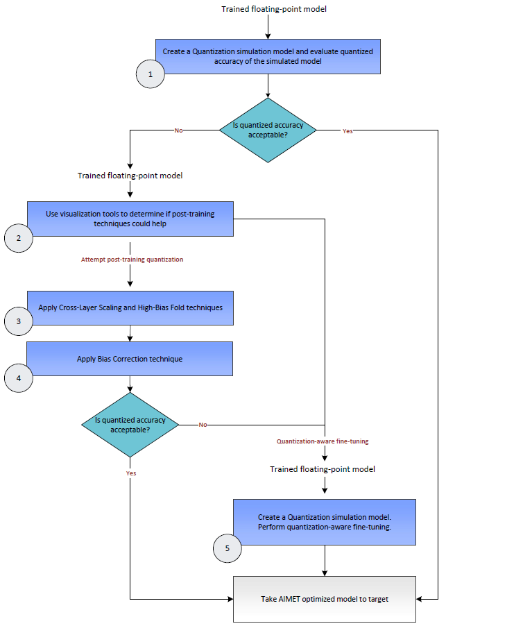

:orphan:

.. _ug-model-quantization:

AIMET Model Quantization
========================

Models are generally trained on floating-point hardware like CPUs and GPUs.
However, when these trained models are run on quantized hardware that support fixed-precision operations, model parameters are converted from floating-point precision to fixed precision.
As an example, when running on hardware that supports 8-bit integer operations, the floating point parameters in the trained model need to be converted to 8-bit integers.
It is observed that for some models, running on a 8-bit fixed-precision runtime introduces a loss in accuracy due to noise introduced due to the use of fixed precision parameters and also fixed precision operations.

AIMET provides multiple techniques and tools that help to create quantized models with a minimal loss in accuracy relative to floating-point models.

Use Cases
=========
1. **Predict on-target accuracy**: AIMET enables a user to simulate the effects of quantization to get a first order estimate of the model’s accuracy when run on quantized targets. This is useful to get an estimate of on-target accuracy without needing an actual target platform. Note that to create a simulation model, AIMET uses representative data samples to compute per-layer quantization encodings.

    .. image:: ../images/quant_use_case_1.PNG

2. **Fine-tune model for computed per-layer encodings**: AIMET enables a user to compute per-layer quantization encodings using representative data samples. And it further enables the user to use a training pipeline to fine-tune the model to improve quantized accuracy given these computed encodings.

    .. image:: ../images/quant_use_case_2.PNG

3. **Post-training quantization (no fine-tuning)**: In some cases, a user may want to not further train the model to improve quantized accuracy. Some reasons for this may be
	- May not have access to a training pipeline for this model
	- May not have access to labeled training data to use for fine-tuning
	- May want to avoid the time and effort it would take to pick the right hyper-parameters and train the model

    In the above scenarios, AIMET provides a set of post-training quantization techniques that alter the model parameters to enable better quantized accuracy. These techniques are designed to fix for specific equalization issues in the model and may not work for all models.

    .. image:: ../images/quant_use_case_3.PNG

User Flow
=========

The following diagram shows a decision flow that can used to determine how to make best use of the techniques available in AIMET.
Relevant steps in the diagram are annotated with a green circle with a number. Following the diagram, more details are provided for each of the annotated steps.

#. :ref:`Quantization Simulation<ug-quantsim>`: AIMET enables a user to modify a model to add quantization simulation ops. When an evaluation is run on a model with these quantization simulation ops, the user can observe a first-order simulation of expected accuracy on quantized hardware.

#. :ref:`Quantization Visualization<ug-quantization-visualization>`: AIMET provides visualization tools that help guide the user to determine if AIMET post-training quantization techniques are useful for a given model

#. :ref:`Applying Cross-Layer Equalization<ug-post-training-quantization>`: Post-training quantization techniques help a model improve quantized accuracy without needing to re-train. Cross-Layer Equalization equalizes weight ranges in consecutive layers.

#. :ref:`Applying Bias Correction<ug-post-training-quantization>`: Bias Correction corrects for a shift in layer outputs due to quantization noise

#. :ref:`Quantization-aware Fine-tuning<ug-quantsim>`: The user can train using the Quantization Sim model generated by AIMET to improve quantized accuracy of the model. This is simulating fine-tuning of the model on quantized hardware.
