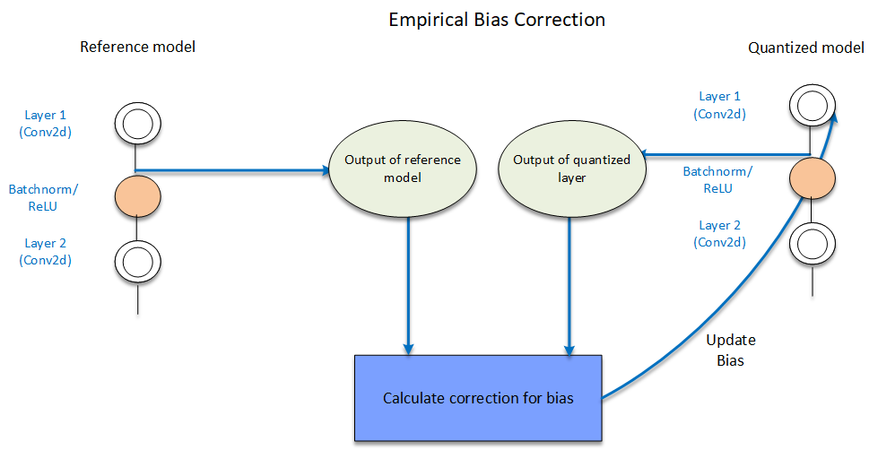
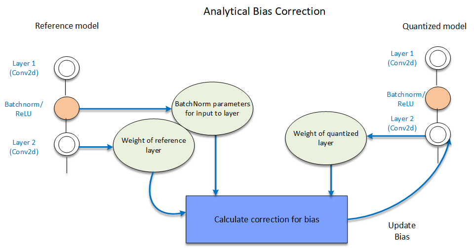

:orphan:

.. _ug-post-training-quantization:

===========================================
AIMET Post-Training Quantization Techniques
===========================================

Overview
========

It is observed that some ML models show reduced inference accuracy when run on quantized hardware due to approximation noises. AIMET provides quantization post-training techniques that help adjust the parameters in the model such that the model becomes more quantization-friendly. AIMET post-quantization techniques are designed to be applied on pre-trained ML models. These techniques are explained as part of the "Data-Free Quantization Through Weight Equalization and Bias Correction” paper at ICCV 2019 - https://arxiv.org/abs/1906.04721

User Flow
=========

        .. image:: ../images/flow_diagram_cle.png

#. BatchNorm Folding: This feature will fold in the batch-norm layers (if present) into surrounding layers.

    |

#. :ref:`Quantization Visualization<ug-quantization-visualization>`: AIMET provides visualization tools that help guide the user to determine if AIMET post-training quantization techniques are useful for a given model. Specifically, the visualization tools will show per-channel ranges of parameters to highlight if there is big discrepancy in ranges between different channels in a layer.

    .. image:: ../images/cle_5.png

    |

#. Replace ReLU6 with ReLU: This feature replaces ReLU6 layers with ReLU layers. This is needed for the subsequent cross-layer scaling step. However, this replacement can lead to a drop in accuracy for some models. If this drop in accuracy is not acceptable, the user may be better off not using the post-training quantization techniques.

    |

#. Cross Layer Scaling: In some models, the parameter ranges for different channels in a layer show a wide variance. This feature attempts to equalize the parameter ranges across different channels. As seen below, the ranges of weights per channel in a layer vary significantly.  Cross-Layer Scaling scales layer's per channel weights of consecutive layers. This helps increase the range for layers with low range and reduce range for layers with high range. Therefore, different channels have similar range and same quantizaion parameters can be used for weights across all channels.

    .. image:: ../images/cle_1.png

   As shown below, AIMET takes in a model and equalizes the distribution of weights per channel of consecutive layers. The scaling factor is calculated and used to scale the weights. The output of the model remains the same and the dynamic range of weight distribution is reduced.

    .. image:: ../images/cle_4.png

    |

#. High Bias Fold: Cross-layer scaling may result in high bias parameter values for some layers. This technique folds some of the bias of a layer into the subsequent layer’s parameters. High-bias fold requires batch-norm parameters to operate on. If the original model did not batch-norm parameters for a given layer, the high-bias fold technique will not be applied to that layer.

    |

#. Bias Correction: Quantization sometimes leads to a shift in layer outputs. This techniques helps correct this shift by adjusting the bias parameters of that layer. Bias parameter is iteratively corrected/updated for each layer. The layer whose bias has to be corrected, and all the layers above it, are quantized. There are two techniques, namely  Empirical Bias Correction and Analytical Bias Correction that are supported for bias correction.

In empirical bias correction technique, representative data is passed through both the FP32 model and quantized model. Outputs are extracted for the layer to be corrected from both the models and used for correcting the bias parameter as shown below which describes correcting bias for a single layer. This process continues for all layers in the model.

In analytical bias correction, data from BatchNorms - when present are used for correction factor estimation instead of passing data through model as in empirical case.

FAQs
====

1. How many samples of data are required to perform Bias Correction?
    *Bias Correction requires a representative set of dataset. We have observed that providing 500-1000 samples works well.*

2. Which is better Empirical Bias Correction or Analytical + Empirical Bias Correction?
    *If speed is not a bottleneck, then it is suggested to use Empirical Bias Correction, else the hybrid approach of combining both.*

References
==========

1.	Markus Nagel, Mart van Baalen, Tijmen Blankevoort, Max Welling. “Data-Free Quantization Through Weight Equalization and Bias Correction.” IEEE International Conference on Computer Vision (ICCV), Seoul, October 2019.