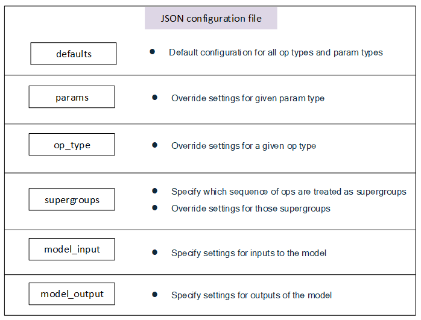

.. _ug-quantsim-config:

======================================
Quantization Simulation Configuration
======================================
Overview
========
AIMET allows the configuration of quantizer placement and settings in accordance with a set of rules specified in a json configuration file, applied when the Quantization Simulation API is called.

Settings such as quantizer enablement, per channel quantization, symmetric quantization, and specifying fused ops when quantizing can be configurated.
The general use case for this file would be for users to match the quantization rules for a particular runtime they would like to simulate.

For examples on how to provide a specific configuration file to AIMET Quantization Simulation,
refer to the API docs for :doc:`PyTorch Quantsim<../api_docs/torch_quantsim>`, :doc:`TensorFlow Quantsim<../api_docs/tensorflow_quantsim>`, and :doc:`Keras Quantsim<../api_docs/keras_quantsim>`.

It is advised for the user to begin with the default configuration file under

|default-quantsim-config-file|

For most users of AIMET, no additional changes to the default configuration file should be needed.

Configuration File Structure
============================
The configuration file contains six main sections, in increasing amounts of specificity:

Rules defined in a more general section can be overruled by subsequent rules defined in a more specific case.
For example, one may specify in "defaults" for no layers to be quantized, but then turn on quantization for specific layers in the "op_type" section.

How to configure individual Configuration File Sections
=======================================================
When working with a new runtime with different rules, or for experimental purposes, users can refer to this section to understand how to configure individual sections in a configuration file.

1. **defaults**:

    .. literalinclude:: ../torch_code_examples/quantsim_config_example.py
       :language: python
       :start-after: # defaults start
       :end-before:  # defaults end

    In the defaults section, it is required to include an "ops" dictionary and a "params" dictionary (though these dictionaries may be empty).

    The "ops" dictionary holds settings that will apply to all activation quantizers in the model.
    In this section, the following settings are available:

        - is_output_quantized:
            An optional parameter. If included, it must be set to "True".
            Including this setting will turn on all output activation quantizers by default.
            If not specified, all activation quantizers will start off as disabled.

            For cases when the runtime quantizes input activations, we typically see this only done for certain op types.
            Configuring these settings for specific op types is covered in sections further below.

        - is_symmetric:
            An optional parameter. If included, possible settings include "True" and "False".
            A "True" setting will place all activation quantizers in symmetric mode by default.
            A "False" setting, or omitting the parameter altogether, will set all activation quantizers to asymmetric mode by default.

    The "params" dictionary holds settings that will apply to all parameter quantizers in the model.
    In this section, the following settings are available:

        - is_quantized:
            An optional parameter. If included, possible settings include "True" and "False".
            A "True" setting will turn on all parameter quantizers by default.
            A "False" setting, or omitting the parameter altogether, will disable all parameter quantizers by default.

        - is_symmetric:
            An optional parameter. If included, possible settings include "True" and "False".
            A "True" setting will place all parameter quantizers in symmetric mode by default.
            A "False" setting, or omitting the parameter altogether, will set all parameter quantizers to asymmetric mode by default.

    Aside from the "ops" and "params" dictionary, additional settings governing quantizers in the model are available:

    - strict_symmetric:
        An optional parameter. If included, possible settings include "True" and "False".
        When set to "True", quantizers which are configured in symmetric mode will use strict symmetric quantization.
        When set to "False" or omitting the parameter altogether, quantizers which are configured in symmetric mode will not use strict symmetric quantization.

    - unsigned_symmetric:
        An optional parameter. If included, possible settings include "True" and "False".
        When set to "True", quantizers which are configured in symmetric mode will use unsigned symmetric quantization when available.
        When set to "False" or omitting the parameter altogether, quantizers which are configured in symmetric mode will not use unsigned symmetric quantization.

    - per_channel_quantization:
        An optional parameter. If included, possible settings include "True" and "False".
        When set to "True", parameter quantizers will use per channel quantization as opposed to per tensor quantization.
        When set to "False" or omitting the parameter altogether, parameter quantizers will use per tensor quantization.

2. **params**:

    .. literalinclude:: ../torch_code_examples/quantsim_config_example.py
       :language: python
       :start-after: # params start
       :end-before:  # params end

    In the params section, settings can be configured for certain types of parameters throughout the model.
    For example, adding settings for "weight" will affect all parameters of type "weight" in the model.
    Currently supported parameter types include:

        - weight
        - bias

    For each parameter type, the following settings are available:

        - is_quantized:
            An optional parameter. If included, possible settings include "True" and "False".
            A "True" setting will turn on all parameter quantizers of that type.
            A "False" setting, will disable all parameter quantizers of that type.
            By omitting the setting, the parameter will fall back to the setting specified by the defaults section.

        - is_symmetric:
            An optional parameter. If included, possible settings include "True" and "False".
            A "True" setting will place all parameter quantizers of that type in symmetric mode.
            A "False" setting will place all parameter quantizers of that type in asymmetric mode.
            By omitting the setting, the parameter will fall back to the setting specified by the defaults section.

3. **op_type**:

    .. literalinclude:: ../torch_code_examples/quantsim_config_example.py
       :language: python
       :start-after: # op_type start
       :end-before:  # op_type end

    In the op type section, settings affecting particular op types can be specified.
    The configuration file recognizes ONNX op types, and will internally map the type to a PyTorch or TensorFlow op type
    depending on which framework is used.

    For each op type, the following settings are available:

        - is_input_quantized:
            An optional parameter. If included, it must be set to "True".
            Including this setting will turn on input quantization for all ops of this op type.
            Omitting the setting will keep input quantization disabled for all ops of this op type.

        - is_output_quantized:
            An optional parameter. If included, possible settings include "True" and "False".
            A "True" setting will turn on output quantization for all ops of this op type.
            A "False" setting will disable output quantization for all ops of this op type.
            By omitting the setting, output quantizers of this op type will fall back to the setting specified by the defaults section.

        - is_symmetric:
                An optional parameter. If included, possible settings include "True" and "False".
                A "True" setting will place all quantizers of this op type in symmetric mode.
                A "False" setting will place all quantizers of this op type in asymmetric mode.
                By omitting the setting, quantizers of this op type will fall back to the setting specified by the defaults section.

        - per_channel_quantization:
            An optional parameter. If included, possible settings include "True" and "False".
            When set to "True", parameter quantizers of this op type will use per channel quantization as opposed to per tensor quantization.
            When set to "False", parameter quantizers of this op type will use per tensor quantization.
            By omitting the setting, parameter quantizers of this op type will fall back to the setting specified by the defaults section.

    For a particular op type, settings for particular parameter types can also be specified.
    For example, specifying settings for weight parameters of a Conv op type will affect only Conv weights and not weights
    of Gemm op types.

    To specify settings for param types of this op type, include a "params" dictionary under the op type.
    Settings for this section follow the same convention as settings for parameter types in the preceding "params" section, however will only affect parameters for this op type.

4. **supergroups**:

    .. literalinclude:: ../torch_code_examples/quantsim_config_example.py
       :language: python
       :start-after: # supergroups start
       :end-before:  # supergroups end

    Supergroups are a sequence of operations which are fused during quantization, meaning no quantization noise is introduced between members of the supergroup.
    For example, specifying ["Conv, "Relu"] as a supergroup disables quantization between any adjacent Conv and Relu ops in the model.

    When searching for supergroups in the model, only sequential groups of ops with no branches in between will be matched with supergroups defined in the list.
    Using ["Conv", "Relu"] as an example, if there was a Conv op in the model whose output is used by both a Relu op and a second op, the supergroup would not take effect for these Conv and Relu ops.

    To specify supergroups in the config file, add each entry as a list of op type strings.
    The configuration file recognizes ONNX op types, and will internally map the types to PyTorch or TensorFlow op types depending on which framework is used.

5. **model_input**:

    .. literalinclude:: ../torch_code_examples/quantsim_config_example.py
       :language: python
       :start-after: # model_input start
       :end-before:  # model_input end

    The "model_input" section is used to configure the quantization of inputs to the model.
    In this section, the following setting is available:

    - is_input_quantized:
        An optional parameter. If included, it must be set to "True".
        Including this setting will turn on quantization for input quantizers to the model.
        Omitting the setting will keep input quantizers set to whatever setting they were in as a result of applying configurations from earlier sections.

6. **model_output**:

    .. literalinclude:: ../torch_code_examples/quantsim_config_example.py
       :language: python
       :start-after: # model_output start
       :end-before:  # model_output end

    The "model_output" section is used to configure the quantization of outputs of the model.
    In this section, the following setting is available:

    - is_output_quantized:
        An optional parameter. If included, it must be set to "True".
        Including this setting will turn on quantization for output quantizers of the model.
        Omitting the setting will keep output quantizers set to whatever setting they were in as a result of applying configurations from earlier sections.
