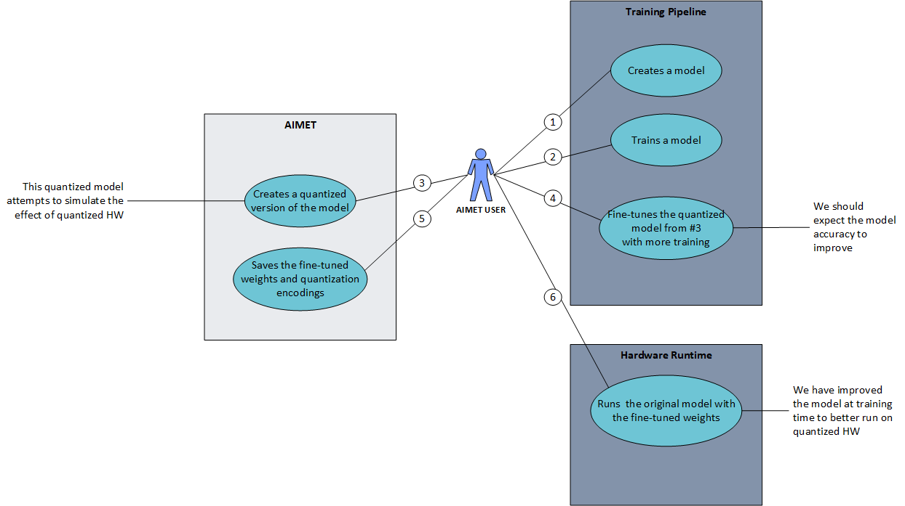
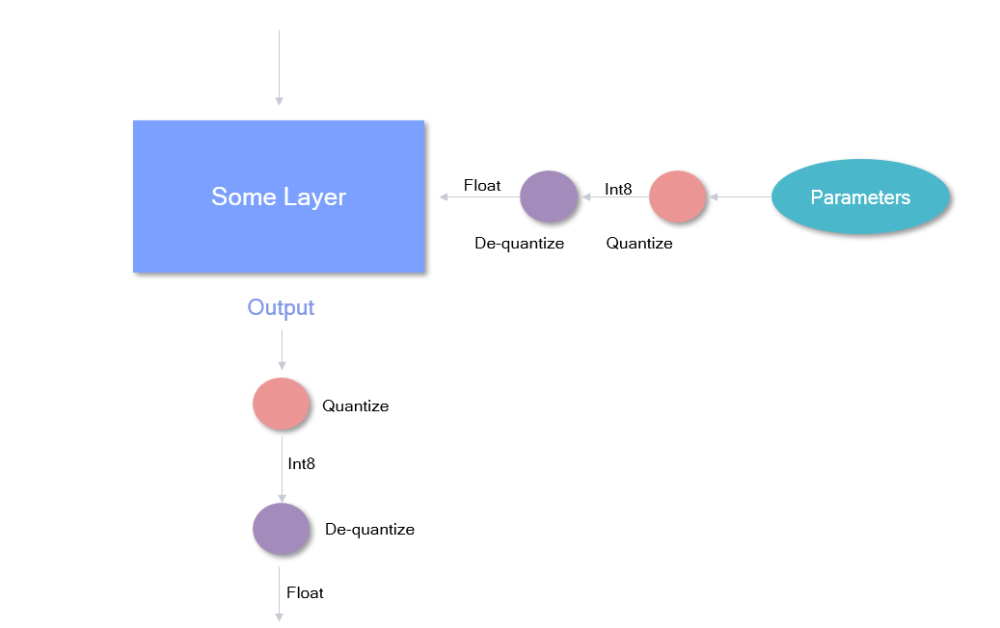
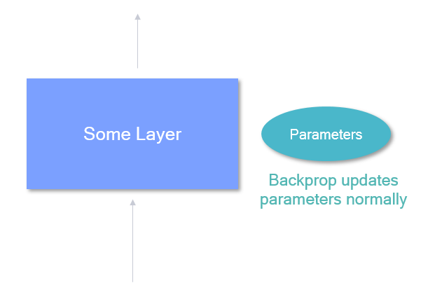

:orphan:

.. _ug-quantsim:

=============================
AIMET Quantization Simulation
=============================
Overview
========
When ML models are run on quantized hardware, the runtime tools (like Qualcomm Neural Processing SDK) will convert the floating-point parameters of the model into fixed-point parameters. This conversion generally leads to a loss in accuracy. AIMET model quantization feature helps alleviate this problem. AIMET provides functionality to change the model to simulate the effects of quantized hardware. This allows the user to then re-train the model further (called fine-tuning) to recover the loss in accuracy. As a final step, AIMET provides functionality to export the model such that it can then be run on target via a runtime.

User Flow
=========

The above explains a typical work flow a AIMET user can follow to make use of the quantization support. The steps are as follows

#. The AIMET user will create their model in one of the supported training frameworks (PyTorch or TensorFlow)
#. User trains their model
#. After the user has a working and trained model, she/he can invoke the AIMET quantization APIs to created a quantized version of the model. During this step, AIMET uses a dataloader passed in by the user to analyze the model and determine the best quantization encodings on a per-layer basis.
#. User will further train the quantized version of the model. The user can re-train the model just like in Step 2. The model will learn to counter the effect of quantization noise. Please see :ref:`some recommendations<qat_recommendations>` for quantization-aware fine-tuning.
#. User uses AIMET to save the model and the per-layer quantization encodings
#. These can be fed to a runtime like Qualcomm Neural Processing SDK to run the model on target (AIMET Importing encodings into quantized runtimes)

Quantization Noise
==================
The diagram below explains how quantization noise is introduced to a model when its input, output or parameters are quantized and dequantized.

    .. image:: ../images/quant_3.png

Since dequantizated value may not be exactly the same as quantized value, the difference between the two values is the quantization noise.

What happens under the hood
===========================
As explained above, in Step 3, AIMET analyzes the model and determines the optimal quantization encodings per-layer.

.. image:: ../images/quant_2.png

To analyze, AIMET passes some training samples through the model and using hooks, captures the tensors as they are outputted from each layer. A histogram is created to model the distribution of the floating point numbers in the output tensor for each layer.

Using the distribution of the floating point numbers in the output tensor for each layer, AIMET will use a scheme called "Enhanced TensorFlow" to determine the best encodings to convert the floating point numbers to fixed point. An encoding for a layer consists of four numbers:

- Min:     Numbers below these are clamped
- Max:    Numbers above these are clamped
- Delta:   Granularity of the fixed point numbers (is a function of the bit-width selected)
- Offset:  Offset from zero

The delta and offset can be calculated using min and max and vice versa using the equations:
    :math:`delta = \frac{min - max}{{2}^{bitwidth} - 1}` and :math:`offset = \frac{-min}{delta}`

During the fine-tuning phase in Step 4, the following happens in the forward pass:

Weights from a given layer are first quantized to fixed point and then de-quantized back to floating point. And the same is done with the output tensor from the layer itself.
AIMET achieves this by wrapping existing layers with a custom layer that add this functionality in PyTorch, and inserting quantization ops between layers in TensorFlow.

In the backward pass, AIMET will backprop normally. This is achieved by keeping the full-resolution floating point weights as shadow weights to be used during backprop.

Placement of quantization simulation ops in the model
=====================================================
AIMET allows the configuration of quantizer placement in accordance with a set of rules specified in a json configuration file if provided when the Quantization Simulation API is called.
In the configuration file, quantizers can be turned on and off, and/or configured with asymmetric or symmetric encodings.
The general use case for this file would be for users to match the quantization rules for a particular runtime they would like to simulate.

The configuration file contains six main sections, in increasing amounts of specificity:

.. image:: ../images/quantsim_config_file.png

Rules defined in a more general section can be overruled by subsequent rules defined in a more specific case.
For example, one may specify in "defaults" for no layers to be quantized, but then turn on quantization for specific layers in the "op_type" section.

It is advised for the user to begin with the default configuration file under

|default-quantsim-config-file|

.. _qat_recommendations:

Recommendations for quantization-aware fine-tuning
==================================================
Here are some general guidelines that can aid in improving performance or faster convergence with Quantization-aware Training (QAT):

* Initialization:
    - Often it can be beneficial to first apply :ref:`post-training quantization<ug-post-training-quantization>` (Cross layer equalization (CLE) and bias correction) before applying QAT. This is especially beneficial if there is large drop in INT8 performance compared to the FP32 baseline.
* Hyper-parameters:
    - Number of epochs: 15-20 epochs are generally sufficient for convergence
    - Learning rate: Comparable (or one order higher) to FP32 model’s final learning rate at convergence. Results in AIMET are with learning of the order 1e-6.
    - Learning rate schedule: Divide learning rate by 10 every 5-10 epochs
