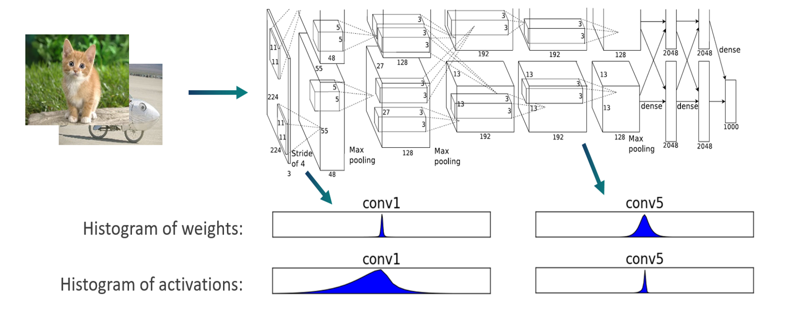

.. _ug-quantsim:

=============================
AIMET Quantization Simulation
=============================
Overview
========
AIMET’s Quantization Simulation feature provides functionality to simulate the effects of quantized hardware. This
allows the user to then apply post-training and/or fine-tuning techniques in AIMET to recover the loss in accuracy, and
ultimately deploy the model on the target device.

When applying QuantSim by itself, optimal quantization scale/offset parameters for each quantizer are found, but no
techniques for mitigating accuracy loss from quantization are applied. Users can either pass their original model
directly to QuantSim to simulate quantization noise on the starting model, or apply Post-Training Quantization
techniques to obtain an updated model to then pass into QuantSim to observe a difference in quantization accuracy as a
result of applying the techniques.

Once a QuantSim object has been created, users can fine-tune the model within the QuantSim object using their
existing pipeline. This method is described in the :ref:`Quantization Aware Training<ug-quantization-aware-training>` page.

The quantization nodes used in QuantSim are custom quantizers defined in AIMET, and are not recognized by targets.
QuantSim provides an export functionality that will save a copy of the model with quantization nodes removed, as well as
generate an encodings file containing quantization scale/offset parameters for each activation and weight tensor in
the model.

A hardware runtime can ingest the encodings file and match it with the exported model to find what scale/offset values
to apply on each tensor in the model.

QuantSim Workflow
=================

A typical workflow for using AIMET quantization simulation to simulate on-target quantized accuracy is described below.

1. The user starts with a pretrained floating-point FP32 model.

2. AIMET creates a simulation model by inserting quantization simulation ops into the model graph as explained in the
   sub-section below.

3. AIMET also configures the inserted simulation ops. The  configuration of these ops can be controlled via a
   configuration file as discussed in sub-section below.

4. AIMET finds optimal quantization parameters, such as scale/offsets, for the inserted quantization simulation ops. To
   do this, AIMET requires the user to provide a callback method that feeds a few representative data samples through
   the model. These samples can either be from the training or calibration datasets. Generally, samples in the order of
   1,000-2,000 have been sufficient for AIMET to find optimal quantization parameters.

5. AIMET returns a quantization simulation model that can be used as a drop-in replacement for the original model in
   their evaluation pipeline. Running this simulation model through the evaluation pipeline yields a quantized accuracy
   metric that closely simulates on-target accuracy.

6. The user can call .export() on the sim object to save a copy of the model with quantization nodes removed, along with
   an encodings file containing quantization scale/offset parameters for each activation and weight tensor in the model.

Simulating Quantization Noise
=============================
The diagram below explains how quantization noise is introduced to a model when its input, output or parameters are
quantized and dequantized.

    .. image:: ../images/quant_3.png

Since dequantizated value may not be exactly the same as quantized value, the difference between the two values is the
quantization noise.

In order to simulate quantization noise, AIMET QuantSim adds quantizer ops to the PyTorch/TensorFlow/Keras model graph.
The resulting model graph can be used as is in the user’s evaluation or training pipeline.

Determining Quantization Parameters (Encodings)
===============================================
Using a QuantSim model, AIMET analyzes and determines the optimal quantization encodings (scale and offset parameters)
for each quantizer op.

To do this, AIMET passes some calibration samples through the model. Using hooks, tensor data is intercepted while
flowing through the model. A histogram is created to model the distribution of the floating point numbers in the output
tensor for each layer.

Using the distribution of the floating point numbers in the output tensor for each layer, quantization encodings are
computed using the specified quantization calibration technique. An encoding for a layer consists of four numbers:

- Min (q\ :sub:`min`\ ):     Numbers below these are clamped
- Max (q\ :sub:`max`\ ):    Numbers above these are clamped
- Delta:   Granularity of the fixed point numbers (is a function of the bit-width selected)
- Offset:  Offset from zero

The delta and offset can be calculated using min and max and vice versa using the equations:
    :math:`delta = \frac{min - max}{{2}^{bitwidth} - 1}` and :math:`offset = \frac{-min}{delta}`

Quantization Schemes
====================
AIMET supports various techniques for coming up with min and max values for encodings, also called quantization schemes:

- Min-Max: Also referred to as "TF" in AIMET (The name TF represents the origin of this technique and
  has no relation to what framework the user is using). To cover the whole dynamic range of the tensor, we can define
  the quantization parameters Min and Max to be the observed Min and Max during the calibration process. This leads to
  no clipping error. However, this approach is sensitive to outliers, as strong outliers may cause excessive rounding
  errors.

- Signal-to-Quantization-Noise (SQNR): Also referred to as “TF Enhanced” in AIMET (The name TF
  represents the origin of this technique and has no relation to what framework the user is using). The SQNR approach is
  similar to the Mean Square Error (MSE) minimization approach. In the SQNR range setting method, we find qmin and qmax
  that minimize the total MSE between the original and the quantized tensor. Quantization noise and saturation noise are
  different types of erros which are weighted differently.

For each quantization scheme, there are "post training" and "training range learning" variants. The "post training"
variants are used during regular QuantSim inference as well as QAT without Range Learning, to come up with initial
encoding values for each quantization node. In QAT without Range Learning, encoding values for activation quantizers
will remain static (encoding values for parameter quantizers will change in accordance with changing parameter values
during training).

The "training range learning" variants are used during QAT with Range Learning. The schemes define how to come up with
initial encoding values for each quantization node, but also allow encoding values for activations to be learned
alongside parameter quantizer encodings during training.

For more details on QAT, refer to :ref:`Quantization Aware Training<ug-quantization-aware-training>`.

Configuring Quantization Simulation Ops
=======================================

Different hardware and on-device runtimes may support different quantization choices for neural network inference. For
example, some runtimes may support asymmetric quantization for both activations and weights, whereas other ones may
support asymmetric quantization just for weights.

As a result, we need to make quantization choices during simulation that best reflect our target runtime and hardware.
AIMET provides a default configuration file, which can be modified. This file is used during quantization simulation if
no other configuration file is specified.  By default, following configuration is used for quantization simulation:

- Weight quantization: Per-channel, symmetric quantization, INT8

- Activation or layer output quantization: Per-tensor, asymmetric quantization, INT8

Quantization options that can be controlled via the configuration file include the following:

- Enabling/disabling of input and output quantizer ops
- Enabling/disabling of parameter quantizer ops
- Enabling/disabling of model input quantizer
- Enabling/disabling of model output quantizer
- Symmetric/Asymmetric quantization
- Unsigned/signed symmetric quantization
- Strict/non strict symmetric quantization
- Per channel/per tensor quantization
- Defining groups of layers to be fused (no quantization done on intermediate tensors within fused layers)

Please see the :ref:`Quantization Simulation Configuration <ug-quantsim-config>` page which describes the configuration
options in detail.

Frequently Asked Questions
==========================
- Q: How many samples are needed in the calibration step (compute encodings)?
    A: 1,000 - 2,000 unlabeled representative data samples are sufficient.