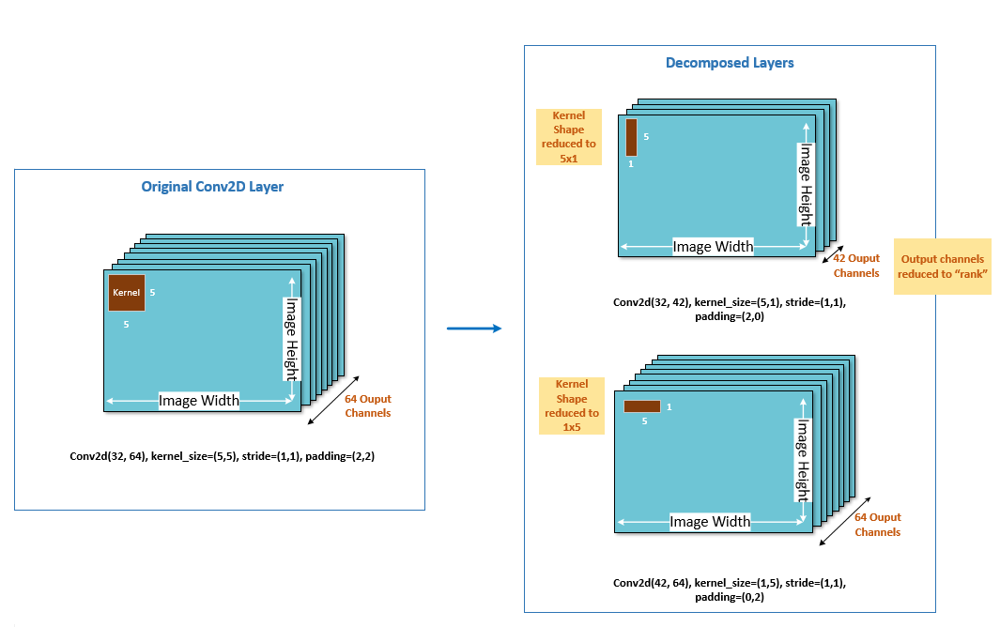

:orphan:

.. _ug-spatial-svd:

=================
AIMET Spatial SVD
=================

Spatial SVD is a tensor decomposition technique which decomposes one large layer (in terms of mac or memory) into two smaller layers. SVD stands for Singular Value Decomposition.

Given a conv layer, with kernel (𝑚,𝑛,ℎ,𝑤) where 𝑚 is the input channels, 𝑛 the output channels, and ℎ, 𝑤 giving the height and width of the kernel itself, Spatial SVD will decompose the kernel into two kernels. One of size (𝑚,𝑘,ℎ,1) and one of size (𝑘,𝑛,1,𝑤), where k is called the rank. The smaller the value of k the larger the degree of compression achieved.

The following diagram illustrates this visually. As you can see, Spatial SVD decomposes both the output channel dimension as well as the size of the conv kernel itself. Spatial SVD is currently supported for Conv layers in AIMET.

