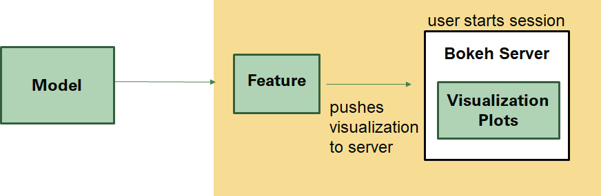
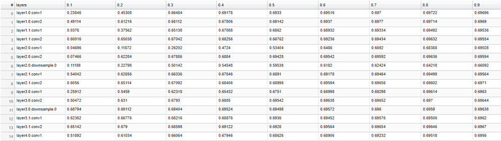
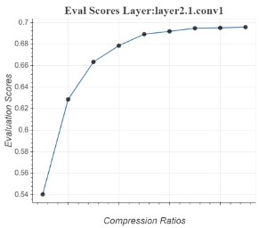
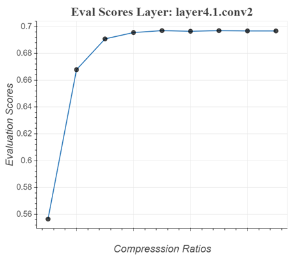
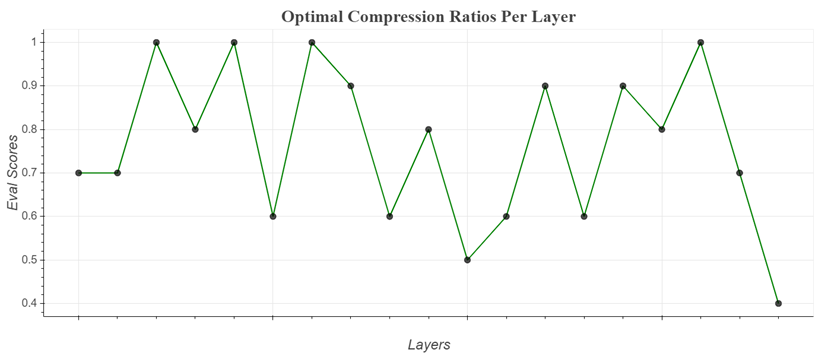

===================
AIMET Visualization
===================

Overview
========
AIMET Visualization adds analytical capability to the AIMET tool (which helps quantize and compress ML models) through visualization. It provide more detailed insights in to AIMET features as users are able to analyze a model’s layers in terms of compressibility and also highlight potential issues when applying quantization. The tool also assists in displaying progress for computationally heavy tasks.

Design
======
Given a model, a user can start a Bokeh server session and then invoke functions which will produce visualizations to help analyze and understand the model before using AIMET features from quantization and compression

Compression
===========
Evaluation scores during compression are displayed in a table as they are computed and users can see the progress displayed while computing these scores. After Greedy Selection has run, the optimal compression ratios are also displayed in a graph

Starting a Bokeh Server Session:
================================
Start a bokeh server by typing this command: bokeh serve --allow-websocket-origin=<host name>:<port number> --port=<port number>

--allow-websocket-origin tells the Bokeh server which network addresses to listen on, again not typically needed for local It is not need just to view locally.

--port tells the Bokeh server what network port to listen on rather than the default port of 5006

How to use the tool
===================

**Model Compression**

#. Start a bokeh server by typing this command: bokeh serve --allow-websocket-origin=<host name>:<port number> --port=<port number>
#. To visualize eval scores and compression ratios during execution time:
    a) Input a visualization URL into the top level function: compress_model. This url is http://<host name>:<port number>/
        i) For model compression, the visualization url is passed through compress_model. If no visualizations are necessary then the url has a default option for None.
    b) Finally, go to the URL to see the visualizations.
        i) The session-id here is: compression. So the URL would look something like this:
        ii) http://<host name>:<port number>/?&bokeh-session-id=compression
#. To visualize eval scores and compression ratios after execution:
    a) Use API doc to decide which functions to use. They should be under "Model Compression."
        i) First instantiate a VisualizeCompression instance by passing in a visualization URL. This url is http://<host name>:<port number>/
    b) There are two functions:
        i) display_eval_scores
        ii) display_comp_ratio_plot
    c) Finally, go to the URL to see the visualizations
        i) The session-id here is: compression. So the URL would look something like this:
        ii) http://<host name>:<port number>/?&bokeh-session-id=compression
