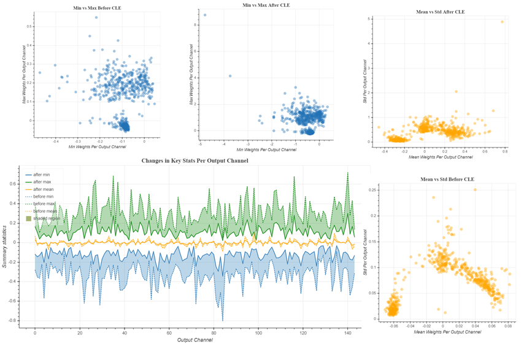

:orphan:

.. _ug-quantization-visualization:

====================================
AIMET Visualization for Quantization
====================================

Overview
========
AIMET Visualization adds analytical capability to the AIMET tool (which helps quantize and compress ML models) through visualization. It provide more detailed insights in to AIMET features as users are able to analyze a model's layers in terms of compressibility and also highlight potential issues when applying quantization. The tool also assists in displaying progress for computationally heavy tasks. The visualizations get saved as an HTML file under the specified directory.

Quantization
============
During quantization, common parameters are used throughout a layer for converting the floating point weight values to INT8. If the dynamic range in weights is very high the quantization will not be very granular. To equalize the weight range we apply Cross Layer Equalization.
In order to understand if we need to apply Cross Layer Equalization, we can visualize the weight range for every channel in a layer. If the weight range varies a lot over the various channels, applying cross layer equalization helps in improving the Quantization accuracy.

PyTorch
-------

In PyTorch, we can visualize the weights for a model. We can also visualize the weight ranges for a model before and after Cross Layer Equalization.
There are three main functions a user can invoke:

#. User can analyze relative weight ranges of model to see potentially problematic layers for quantization
#. User can understand each layer in the model
#. User can visualize the model, comparing weights before and after quantization.

TensorFlow
----------

In TensorFlow, we can visualize the weight ranges and relative weight ranges over various channels in a layer.
User can also use the same functions to see the changes in a layer weight ranges before and after Cross Layer Equalization.

There are two main functions a user can invoke:

#. User can analyze relative weight ranges of a layer to see potentially problematic layers for quantization
#. User can visualize weight ranges of a layer and see the various statistics for weights
