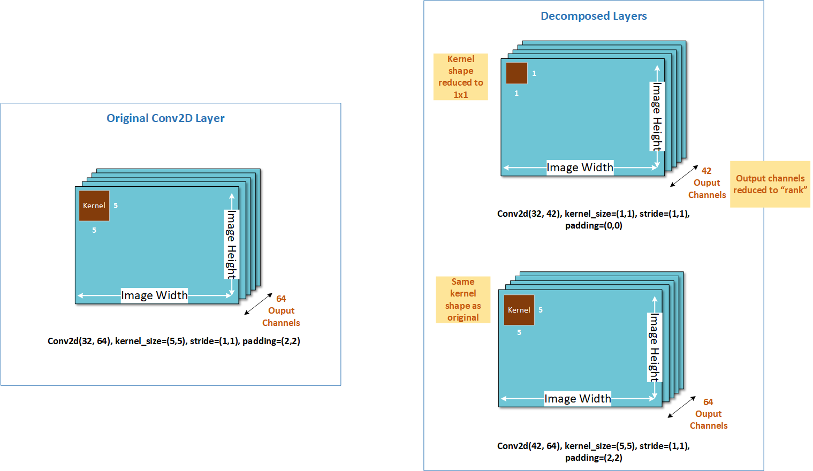

================
AIMET Weight SVD
================

Weight SVD is a tensor decomposition technique which decomposes one large layer (in terms of mac or memory) into two smaller layers. SVD stands for Singular Value Decomposition.

Given a neural network layer, with kernel (𝑚,𝑛,ℎ,𝑤) where 𝑚 is the input channels, 𝑛 the output channels, and ℎ, 𝑤 giving the height and width of the kernel itself, Weight SVD will decompose the kernel into one of size (𝑚,𝑘,1,1) and another of size (𝑘,𝑛,h,𝑤), where 𝑘 is called the rank. The smaller the value of 𝑘 the larger the degree of compression achieved.

The following diagram illustrates this visually. As you can see, Weight SVD decomposes the output channel dimension. Weight SVD is currently supported for Conv and Full-connected layers in AIMET.

