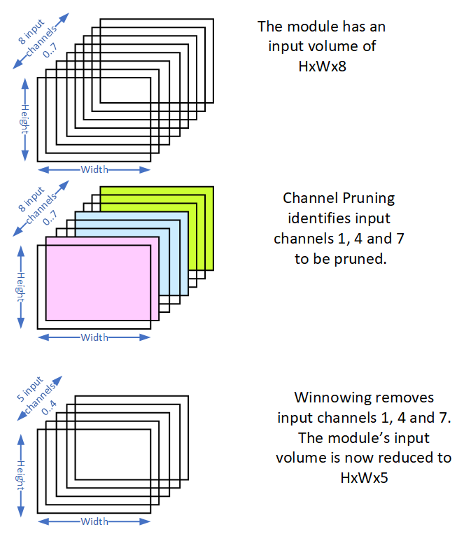
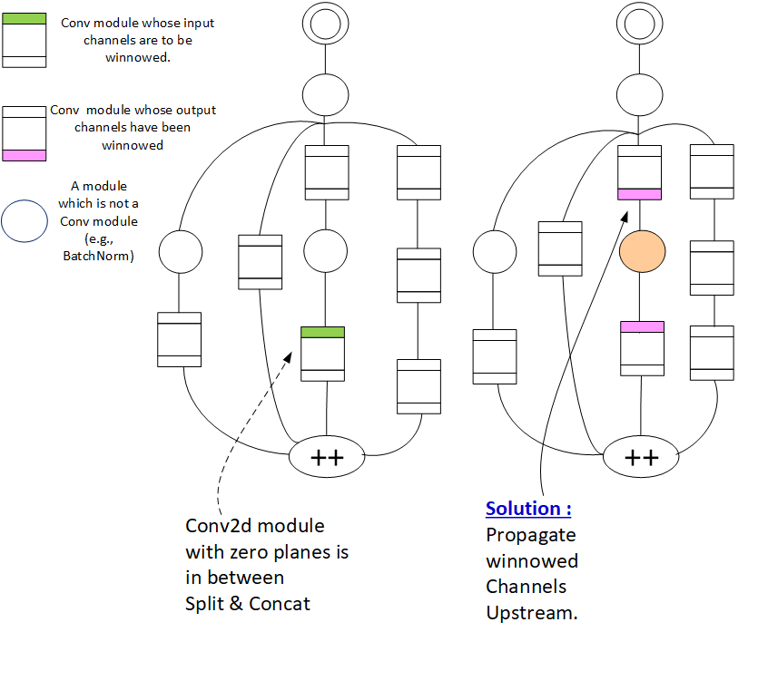

===============
AIMET Winnowing
===============

Overview
========
The model compression algorithm, Channel Pruning, identifies modules in a model, whose subset of input channels could be pruned without losing much accuracy. Unless explicitly removed, these input channels take up memory and add to unnecessary computation. For each identified module, the Winnow tool removes the input channels that were selected for pruning. Only Conv2D layers are supported for winnowing.

Winnowing Overview
==================
The following figure provides a pictorial overview of  Winnowing. In this example, a module in a model has an input volume of **HxWx8**, where H = Height, W = Width and Number of input Channels = 8. The Channel Pruning algorithm identifies that for this module, input channels 1, 4 and 7 should be pruned. Winnowing removes the identified input channels from this modules. The module's input volume is now reduced to **HxWx5**.

How Winnowing Works
===================
When the number of input channels of a Conv module is reduced, the output channels of the module above it must also be modified. If the module above is a another Conv layer, that Conv layer's output channels are also reduced to match the number of input channels of the winnowed Conv module. If the module above is NOT a Conv layer (e.g., BatchNorm, ReLU), that module simply propagates the changes upstream.  That is both the output and the input channels of teh BatchNorm and ReLU modules are winnowed to match the winnowed channels of the Conv layer just below them.

The following figure explains a very simple scenario. In this scenario, a Conv module has been identified for winnowing a sub set of its input channels. This is indicated by green color on the left side of the figure. The right side of the figure indicates the actions taken by Winnowing. Winnowing consists of the following changes done to the 3 affected modules.

The identified Conv module's sub set of input channels are removed. This is indicated by pink color on the right side of the figure.
The module just above the winnowed Conv module is NOT a Conv module. It could be  a ReLU or a BatchNorm module. For this module the corresponding output and input channels are winnowed. This is indicated by orange color on the right side of the figure.
The module above the ReLU/BatchNorm is another Conv module. This Conv module's output channels are winnowed.This is indicated by pink color on the right side of the figure.

